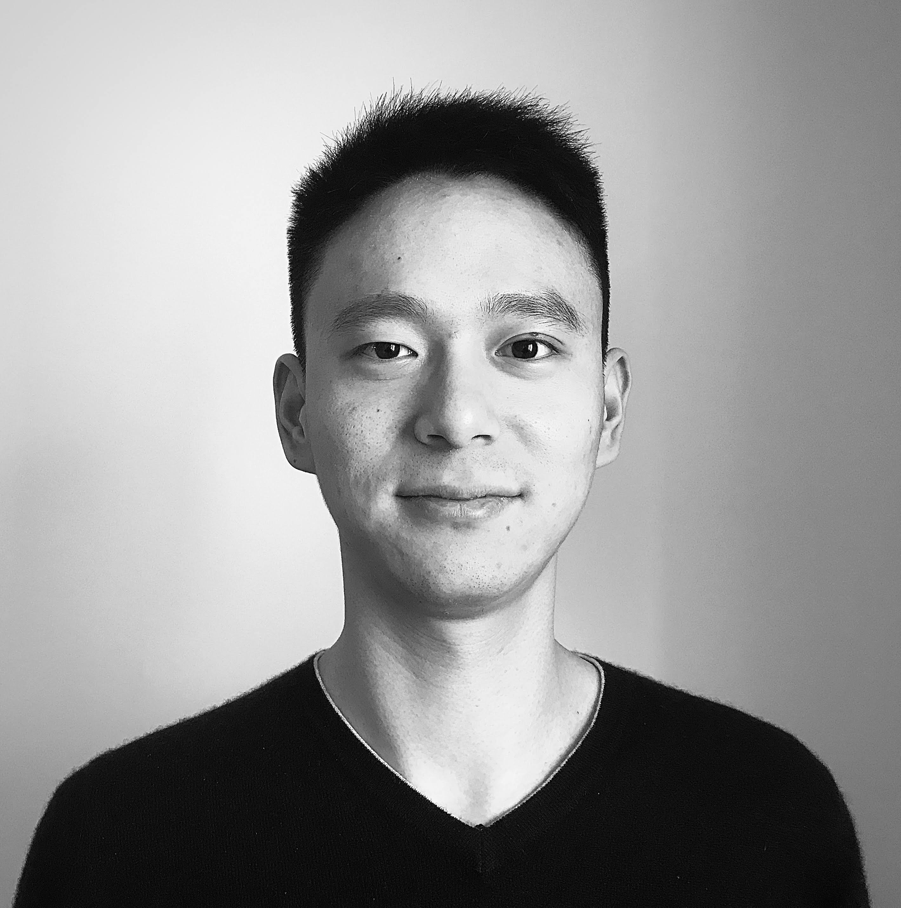

# About Me

I am a **PhD student in [Modeling and Data Science](https://dottorato-mds.campusnet.unito.it/do/home.pl)** at [University of Turin](https://www.unito.it/). Outside of Academia, I currently work as a **Data Scientist** at the "Data Science and Artificial Intelligence" department of [Intesa Sanpaolo](https://www.intesasanpaolo.com/) which is an Italian commercial banking group. Inside the company, my teams develop end-to-end machine learning solutions (exploration, implementation and deploy) in different areas of the company, delivering actionable insights by merging technical knowledge with the expertise of the business units.

## Work Experience

- 2016/08 - Present   Data Science Team Leader, *Data Science and AI, [Intesa Sanpaolo](https://www.intesasanpaolo.com/)*
- 2016/02 - 2016/07   Research Assistant, *IGIER, [Bocconi University](https://www.unibocconi.eu/)*

#### Minor Experience

- 2018/12 - 2019/12   Textbooks Proofreader, *[Loescher Editore](https://www.loescher.it/)* 
- 2015/10 - 2016/03   Strategy Thinker, *Innovation and Competitiveness, [University of Turin](https://www.unito.it/)*
- 2012/05 - 2013/09   Teaching Assistant, *[Department of Mathematics](https://dipmath.campusnet.unito.it/do/home.pl), [University of Turin](https://www.unito.it/)*
- 2011/10 - 2014/05   Mathematical Olympiad Trainer, *[Associazione Subalpina Mathesis](http://www.associazionesubalpinamathesis.it/en/)*

## Research 

My research interests include:

- semi-supervised learning;
- fairness;
- network science.

Check my [Google Scholar Profile](https://scholar.google.com/citations?user=BgWDJDkAAAAJ) for the latest updates. 

## Education
- 2019/10 - Present   PhD in Modeling and Data Science, *[University of Turin](https://www.unito.it/)* 
- 2014/09 - 2016/07   MSc Mathematics, *[University of Turin](https://www.unito.it/)*
- 2013/08 - 2016/07   MA Economics, [Allievi Honors Program](https://www.carloalberto.org/education/allievi-honors-program/overview/), *[Collegio Carlo Alberto](https://www.carloalberto.org/)*

